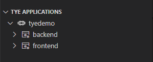
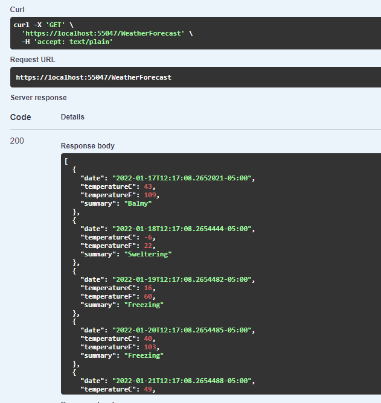

# Project Tye
1. Describe what PT is
2. Why is it experimental?
3. Should you still use it?

## Project Tye Resources
- [Git Hub Repository](https://github.com/dotnet/tye)
- [Project Tye Documentation](https://github.com/dotnet/tye/blob/main/docs/README.md)
    - [Getting Started](https://github.com/dotnet/tye/blob/main/docs/getting_started.md)

## Before you start
Even though you can use Project Tye from Visual Studio 2019 or 2022, I will be using VS Code with .NET SDK version 6.0.101.

### Install the Project Tye CLI 
>Project Tye is a global command line tool. These kinds of tools can be installed easily by using the *dotnet tool install* command. Please refer to the [Getting Started](https://github.com/dotnet/tye/blob/main/docs/getting_started.md) documentation for the latest command. I am using the CI/CD build because while I was experimenting with Tye, I ran into some hiccups with the **Undeploy** command.

From a Terminal window, install the Project Tye CLI with the following command:

```
dotnet tool install -g Microsoft.Tye --version "0.11.0-*" --add-source https://pkgs.dev.azure.com/dnceng/public/_packaging/dotnet5/nuget/v3/index.json
```
Once installed, the commands supported by Project Tye can be listed by entering the following into a terminal window: 

```
tye
```

|Command  | Description|
|--------| --------|
|init <path>    |    create a yaml manifest|
|run <path>     |    run the application|
|build <path>  |     build containers for the application |
|push <path>    |    build and push application containers to registry|
|deploy <path> |     deploy the application|
|undeploy <path>  |  delete deployed application|

Example:
```
tye run
```
### Install Docker for Desktop
> Docker is an essential component in the overall strategy of Project Tye. If you are not currently using Docker, don't let this intimidate you. Project Tye utlimately will "ease" you into Docker. Starting with Windows 10, Microsoft has provided the "Windows Subsystem for Linux", or, more commonly referred to as WSL. You will want to make sure that your system can run WSL 2.
- [Configure Windows 10 for WSL 2](https://docs.microsoft.com/en-us/windows/wsl/install#upgrade-version-from-wsl-1-to-wsl-2)
- [Configure Docker Desktop for WSL 2](https://docs.docker.com/desktop/windows/wsl/)

### Install the VS Code Plugin
> The Project Tye team have made a VS Code Extension for Tye. This plugin is one of the reasons that using VS Code to get started with Tye is recommended. it is listed in the Extensions Market place as "Tye."


# A Simple Example
> The Tye example starts with a frontend project and a backend project. The main idea is "Service Discovery" and how your Tye handles the connections between projects that it knows about.

The easiest example to begin with is not very impressive. However, it is a starting point on which we can begin.

Start by executing the following commands one at a time in a terminal window:

```
mkdir tyedemo
cd tyedemo

dotnet new razor -o frontend
dotnet new sln
dotnet sln add frontend
```
This creates a Razor page webapp called "frontend." A solution file was also created and the frontend project was added. 

Next, enter: `tye run`

Tye generates the following output:

```
[10:19:48 INF] Executing application from D:\projects\ProjectTyeBlogArticle\src\tyedemo.sln
[10:19:48 INF] Dashboard running on http://127.0.0.1:8000
[10:19:48 INF] Building projects
[10:19:50 INF] Application tyedemo started successfully with Pid: 17420
[10:19:50 INF] Launching service frontend_ad401214-5: D:\projects\ProjectTyeBlogArticle\src\frontend\bin\Debug\net6.0\frontend.exe
[10:19:50 INF] frontend_ad401214-5 running on process id 11084 bound to http://localhost:51094, https://localhost:51095
[10:19:50 INF] Replica frontend_ad401214-5 is moving to a ready state
[10:19:50 INF] Selected process 11084.
[10:19:50 INF] Listening for event pipe events for frontend_ad401214-5 on process id 11084
```
The output to highlight is

1. Tye has a dashboard and has started it
2. Tye build the projects in the solution and then assigns ports

## Tye Extension
With Tye Running, the Tye extension for VS Code shows the running application. Hover over the application, and several icons are displayed


1. The first icon will open the Tye Dashboard
2. The middle icon will attach VS Code to the running process for debugging
3. The last icon stops the application. This is the same as entering `Ctrl-C` in the terminal window.

Hovering over the frontend service


1. The first icon attaches a debugger to the process.
2. The middle icon will browse to the service.
3. The last icon will open up the service's log.

As more is added to the demo, observe what is displayed in the Tye extension.

## Tye Dashboard
The Tye Dashboard shows all of the running services. 
|Column| Description|
|----|---|
|Name| The name of the service. Clicking on the link displays metrics about the running service|
|Type| The type of services. For the initial demo, this is simply a .NET Project|
|Source| The location of the code|
|Bindings|The ports that Tye generated and assigned. Clicking on the link will open the website in another tab.|
|Replicas|Replicas are the number of instances of the service running. By default, it runs only 1 replica, but tye can be configured to run multiple.|
|Restarts|Lists the number of times the service restarted. This *should* have 0 restarts, but could indicate that something is wrong with the service if it continually resets.|
|Logs|Will display the current log output for the service.|

# Add a Web API Backend
> Adding a Web API as a backend will help demonstrate how Project Tye helps with starting multiple projects and service discover. In the previous example, Tye generated the bindings automatically. If it does this, how do we know how to configure the frontend to be able to talk to the backend? This is where Tye steps in with Service Location. Project Tye has a nuget package that provides extensions to .NET Core's Configuration

Start by making sure that you are in the tyedemo directory. Then run the following commands in the terminal window:

```
dotnet new webapi -o backend
dotnet sln add backend
```

running a `dir` command should list the following:


```
Mode                LastWriteTime         Length Name
----                -------------         ------ ----
d----         1/16/2022  11:05 AM                  backend
d----         1/16/2022  10:14 AM                  frontend
-a---         1/16/2022  11:13 AM           1476   tyedemo.sln
```

Before configuring the frontend to get data from the backend, execute the command `tye run` in the terminal:

Notice that Tye has run both of the projects and has assigned ports.

```
[11:52:59 INF] Executing application from D:\projects\ProjectTyeBlogArticle\src\tyedemo.sln
[11:52:59 INF] Dashboard running on http://127.0.0.1:8000
[11:52:59 INF] Building projects
[11:53:03 INF] Application tyedemo started successfully with Pid: 16652
[11:53:03 INF] Launching service frontend_40f23a23-8: D:\projects\ProjectTyeBlogArticle\src\frontend\bin\Debug\net6.0\frontend.exe
[11:53:03 INF] Launching service backend_8e14317f-b: D:\projects\ProjectTyeBlogArticle\src\backend\bin\Debug\net6.0\backend.exe
[11:53:03 INF] frontend_40f23a23-8 running on process id 9340 bound to http://localhost:55044, https://localhost:55045
[11:53:03 INF] Replica frontend_40f23a23-8 is moving to a ready state
[11:53:03 INF] backend_8e14317f-b running on process id 12044 bound to http://localhost:55046, https://localhost:55047
[11:53:03 INF] Replica backend_8e14317f-b is moving to a ready state
[11:53:04 INF] Selected process 9340.
[11:53:04 INF] Selected process 12044.
[11:53:04 INF] Listening for event pipe events for frontend_40f23a23-8 on process id 9340
[11:53:04 INF] Listening for event pipe events for backend_8e14317f-b on process id 12044
```
If you go to the dashboard or the Tye extension, you will see the changes there too:



Enter the following command into Terminal to list any running docker images: `docker ps -a`. There should be no packages related to the current project.

If you open the backend api in either the Tye extension or the dashboard, it doesn't open the swagger index page. However, add `/swagger/index.html` in the browser and the backend swagger document should open. The backend contains the standard "WeatherForecast" endpoint that returns a random five day forecast:



Be sure to stop Tye either with the extension or entering `Ctrl-C` in the terminal window.

## Configure Frontend to talk to Backend
The first step in connecting the frontend to the backend is to create a class that represents the WeatherForecast data returned by the backend.

1. Add new class called `WeatherForecast.cs`

```csharp
namespace frontend;
public class WeatherForecast
{
    public DateTime Date { get; set; }

    public int TemperatureC { get; set; }

    public int TemperatureF => 32 + (int)(TemperatureC / 0.5556);

    public string Summary { get; set; }
}
```
> This uses the C# 10 conventions for namespace and global using directives. You can read more about these updates: [What's new in C# 10](https://docs.microsoft.com/en-us/dotnet/csharp/whats-new/csharp-10).*

2. Add a strongly typed WeatherClient class called `WeatherClient.cs`

```csharp
using System.Text.Json;

namespace frontend;

public class WeatherClient
{
    private readonly JsonSerializerOptions options = new JsonSerializerOptions()
    {
        PropertyNameCaseInsensitive = true,
        PropertyNamingPolicy = JsonNamingPolicy.CamelCase,
    };

    private readonly HttpClient client;

    public WeatherClient(HttpClient client)
    {
        this.client = client;
    }

    public async Task<WeatherForecast[]> GetWeatherAsync()
    {
        var responseMessage = await this.client.GetAsync("/weatherforecast");
        var stream = await responseMessage.Content.ReadAsStreamAsync();
        return await JsonSerializer.DeserializeAsync<WeatherForecast[]>(stream, options);
    }
}
```
3. Add a reference to the Tye configuration extensions:
```
dotnet add frontend/frontend.csproj package Microsoft.Tye.Extensions.Configuration  --version "0.4.0-*"
```
4. Configure the WeatherClient in `Program.cs`:
```csharp
// Add services to the container.
builder.Services.AddRazorPages();

builder.Services.AddHttpClient<WeatherClient>(client =>{
    client.BaseAddress = builder.Configuration.GetServiceUri("backend");
});
```
Be sure to add `using frontend;` at the top of `Program.cs`

> With .NET 6, ASP.NET Core combines the `Startup.cs` and the `Program.exe.` You can read about this and other updates: [What's new in ASP.NET Core 6.0](https://docs.microsoft.com/en-us/aspnet/core/release-notes/aspnetcore-6.0?view=aspnetcore-6.0)

Notice that the `GetServiceUri` is part of the Tye Configuration Extensions. Specifying the backend service's name will connect to the backend service's base url. This is a convention that can be modified.

5. Open the `Index.cshtml.cs` file in the frontend solution and add the following code:

```csharp
public WeatherForecast[] Forecasts { get; set; }

public async Task OnGet([FromServices] WeatherClient client)
{
    Forecasts = await client.GetWeatherAsync();
}
```
> Injecting the WeatherClient directly into the Action method is done to keep the code changes minimal. Typically, this would be injected into the controller's constructor method.

6. Update the `Index.cshtml` to render the `Forecasts` array:
```html
@page
@model IndexModel
@{
     ViewData["Title"] = "Home page";
 }

<div class="text-center">
    <h1 class="display-4">Welcome</h1>
    <p>Learn about <a href="https://docs.microsoft.com/aspnet/core">building Web apps with ASP.NET Core</a>.</p>
</div>

Weather Forecast:

 <table class="table">
     <thead>
         <tr>
             <th>Date</th>
             <th>Temp. (C)</th>
             <th>Temp. (F)</th>
             <th>Summary</th>
         </tr>
     </thead>
     <tbody>
         @foreach (var forecast in @Model.Forecasts)
         {
             <tr>
                 <td>@forecast.Date.ToShortDateString()</td>
                 <td>@forecast.TemperatureC</td>
                 <td>@forecast.TemperatureF</td>
                 <td>@forecast.Summary</td>
             </tr>
         }
     </tbody>
 </table>
```

7. Enter `tye run` in the Terminal.
