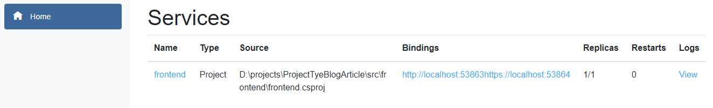
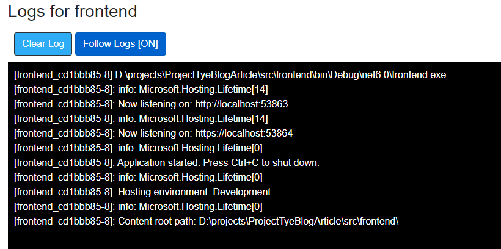
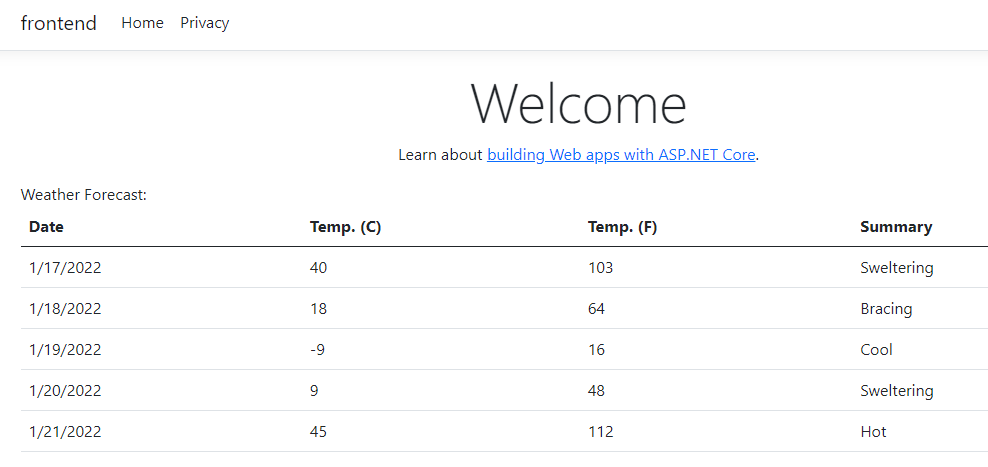
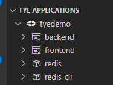
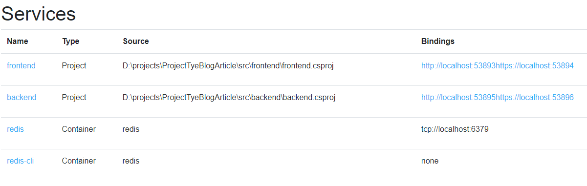

# Getting started with Project Tye

Project Tye is an experimental tool from Microsoft which helps remove many road blocks first experienced by developers learning to implement a microservice based architecture. This article focuses on how Project Tye accomplishes this by

1. Running many services with one command
2. Using dependencies in containers
3. Discovering addresses of other services through convention

Project Tye also helps with deployment to Kubernetes, but is not covered in this article.

 `Project Tye` is "experimental", and as such, not recommended to take a hard dependency on it into production. However, it is a great tool for developers wanting to learn how to develop a microservices based architecture.

## Getting Started

The `Project Tye` Github Page contains many helpful resources and documentation:

- [Git Hub Repository](https://github.com/dotnet/tye)
- [Project Tye Documentation](https://github.com/dotnet/tye/blob/main/docs/README.md)
  - [Getting Started](https://github.com/dotnet/tye/blob/main/docs/getting_started.md)

`Project Tye` can be used with either Visual Studio Code or Visual Studio. However, Visual Studio Code has the `Tye` extension that is not yet available in Visual Studio. Throughout this article, many examples will use the Visual Studio Code Terminal with Powershell.

### Install the Project Tye CLI

Project Tye is a global command line tool which can easily be installed by using the *dotnet tool install* command. Using the terminal window, install the `Project Tye` cli with the following command:

```powershell
dotnet tool install -g Microsoft.Tye --version "0.11.0-*" --add-source https://pkgs.dev.azure.com/dnceng/public/_packaging/dotnet5/nuget/v3/index.json
```

The CLI tool provides several commands. However, for this article, only the `run` and `init` commands are explored.

```powershell
tye
```

| Command  | Description                                       |
| -------- | ------------------------------------------------- |
| init     | create a yaml manifest                            |
| run      | run the application                               |
| build    | build containers for the application              |
| push     | build and push application containers to registry |
| deploy   | deploy the application                            |
| undeploy | delete deployed application                       |

### Install Docker for Desktop

One of the motivations for using Docker is to not have to install dependent services directly on developer's Workstation. For example, this article will use Redis. Instead of downloading and installing Redis on the workstation, an image can be pulled and ran within Docker. Once the Docker Image has been removed, no trace of Redis is left behind on the workstation.

The following documents provide instructions on how to install Docker:

- [Get Docker](https://docs.docker.com/get-docker/)
- [Configure Windows 10 for WSL 2](https://docs.microsoft.com/en-us/windows/wsl/install#upgrade-version-from-wsl-1-to-wsl-2)
- [Configure Docker Desktop for WSL 2](https://docs.docker.com/desktop/windows/wsl/)

Docker will only be used for the last section when Redis is integrated into the solution.

### Install the Visual Studio Code Extension

The Project Tye team have made a `Tye` extension for Visual Studio Code. This extension is very helpful and is referenced throughout this article. It is listed in the Extensions Market place as "Tye."


## A Simple Example

One thing that Tye helps is with Service Discovery and running multiple projects. From a single command, `tye run` multiple projects AND Docker services can be started and all ran within a virtual network. Tye will take care of assigning Ports and provides an elegant solution to both Service Discovery and connection strings.

Start by executing the following commands in a terminal window:

```powershell
mkdir tyedemo
cd tyedemo

dotnet new razor -o frontend
dotnet new sln
dotnet sln add frontend
```

This creates a Razor page webapp and a solution file.

In the terminal, enter `tye run`

Tye generates output similar to the following

```powershell
[10:19:48 INF] Executing application from D:\projects\ProjectTyeBlogArticle\src\tyedemo.sln
[10:19:48 INF] Dashboard running on http://127.0.0.1:8000
[10:19:48 INF] Building projects
[10:19:50 INF] Application tyedemo started successfully with Pid: 17420
[10:19:50 INF] Launching service frontend_ad401214-5: D:\projects\ProjectTyeBlogArticle\src\frontend\bin\Debug\net6.0\frontend.exe
[10:19:50 INF] frontend_ad401214-5 running on process id 11084 bound to http://localhost:51094, https://localhost:51095
[10:19:50 INF] Replica frontend_ad401214-5 is moving to a ready state
[10:19:50 INF] Selected process 11084.
[10:19:50 INF] Listening for event pipe events for frontend_ad401214-5 on process id 11084
```

The output to highlight is

1. Tye has a dashboard and has started it
2. Tye build the projects in the solution and has assigned ports.

With `Tye` running, the `Tye extension` for Visual Studio Code shows the running application. Several icons are displayed when hovering over the application name:


1. The first icon will open the Tye Dashboard
2. The middle icon will attach Visual Studio Code to the running process for debugging
3. The last icon stops the application. This is the same as entering `Ctrl-C` in the terminal window.

The frontend service also has three icons:


1. The first icon attaches a debugger to the process.
2. The middle icon will browse to the service.
3. The last icon will open up the service's log.

`Tye` also has a dashboard that was started with `tye run`:

```powershell
[10:19:48 INF] Dashboard running on http://127.0.0.1:8000
```

The dashboard can be displayed by clicking on the link in the output or by entering it into a browser. The dashboard shows the running frontend and provides:



Clicking on the link for logs link will display:



| Column   | Description                                                                                                                                                           |
| -------- | --------------------------------------------------------------------------------------------------------------------------------------------------------------------- |
| Name     | The name of the service. Clicking on the link displays metrics about the running service                                                                              |
| Type     | The type of services. For the initial demo, this is simply a .NET Project                                                                                             |
| Source   | The location of the code                                                                                                                                              |
| Bindings | The ports Tye generated and assigned. Clicking on the link will open the website in another tab.                                                                 |
| Replicas | Replicas are the number of instances of the service running. By default, it runs only 1 replica, but tye can be configured to run multiple.                           |
| Restarts | Lists the number of times the service restarted. This *should* have 0 restarts, but could indicate something is wrong with the service if it continually resets. |
| Logs     | Will display the current log output for the service.                                                                                                                  |

Stop `tye` by entering `ctrl-c` in the terminal.

## Add a Web API Backend

Adding a Web API as a backend will help demonstrate how Project Tye helps with starting multiple projects and service discovery. It does the latter through a combination of setting environment variables and making use of an package that extends the .NET Core's Configuration

While in the tyedemo directory enter the following:

```powershell
dotnet new webapi -o backend
dotnet sln add backend
```

running a `dir` command should list the following:

```powershell
Mode                LastWriteTime         Length Name
----                -------------         ------ ----
d----         1/16/2022  11:05 AM                backend
d----         1/16/2022  10:14 AM                frontend
-a---         1/16/2022  11:13 AM           1476 tyedemo.sln
```

Executing `tye run` in the terminal will start both projects and make port assignments:

```powershell
[11:52:59 INF] Executing application from D:\projects\ProjectTyeBlogArticle\src\tyedemo.sln
[11:52:59 INF] Dashboard running on http://127.0.0.1:8000
[11:52:59 INF] Building projects
[11:53:03 INF] Application tyedemo started successfully with Pid: 16652
[11:53:03 INF] Launching service frontend_40f23a23-8: D:\projects\ProjectTyeBlogArticle\src\frontend\bin\Debug\net6.0\frontend.exe
[11:53:03 INF] Launching service backend_8e14317f-b: D:\projects\ProjectTyeBlogArticle\src\backend\bin\Debug\net6.0\backend.exe
[11:53:03 INF] frontend_40f23a23-8 running on process id 9340 bound to http://localhost:55044, https://localhost:55045
[11:53:03 INF] Replica frontend_40f23a23-8 is moving to a ready state
[11:53:03 INF] backend_8e14317f-b running on process id 12044 bound to http://localhost:55046, https://localhost:55047
[11:53:03 INF] Replica backend_8e14317f-b is moving to a ready state
[11:53:04 INF] Selected process 9340.
[11:53:04 INF] Selected process 12044.
[11:53:04 INF] Listening for event pipe events for frontend_40f23a23-8 on process id 9340
[11:53:04 INF] Listening for event pipe events for backend_8e14317f-b on process id 12044
```

These changes are reflected in both the Tye extension and the dashboard:


Enter the following command into Terminal to list any running docker images: `docker ps -a`. There should be no packages related to the current project.

The backend contains the standard "WeatherForecast" endpoint which returns a random five day forecast:


Shut down `tye` by entering `ctrl-c` in the terminal.

### Using the Backend Service

In the frontend project, a class to represent the WeatherForecast data returned by the backend.

1. Add new class called `WeatherForecast.cs`

    ```csharp
    namespace frontend;
    public class WeatherForecast
    {
        public DateTime Date { get; set; }

        public int TemperatureC { get; set; }

        public int TemperatureF => 32 + (int)(TemperatureC / 0.5556);

        public string Summary { get; set; }
    }
    ```

    > This uses the C# 10 conventions for namespace and global using directives. Reference [What's new in C# 10](https://docs.microsoft.com/en-us/dotnet/csharp/whats-new/csharp-10).

2. Add a strongly typed WeatherClient class called `WeatherClient.cs` in the frontend project.

    ```csharp
    using System.Text.Json;

    namespace frontend;

    public class WeatherClient
    {
        private readonly JsonSerializerOptions options = new JsonSerializerOptions()
        {
            PropertyNameCaseInsensitive = true,
            PropertyNamingPolicy = JsonNamingPolicy.CamelCase,
        };

        private readonly HttpClient client;

        public WeatherClient(HttpClient client)
        {
            this.client = client;
        }

        public async Task<WeatherForecast[]> GetWeatherAsync()
        {
            var responseMessage = await this.client.GetAsync("/weatherforecast");
            var stream = await responseMessage.Content.ReadAsStreamAsync();
            return await JsonSerializer.DeserializeAsync<WeatherForecast[]>(stream, options);
        }
    }
    ```

3. Add a reference to the `tye` extensions package in the frontend project:

    ```powershell
    dotnet add frontend/frontend.csproj package Microsoft.Tye.Extensions.Configuration  --version "0.4.0-*"
    ```

4. Add the WeatherClient to the service collection and configure it in the frontend's `Program.cs` class:

    ```csharp
    // Add services to the container.
    builder.Services.AddRazorPages();

    builder.Services.AddHttpClient<WeatherClient>(client =>{
        client.BaseAddress = builder.Configuration.GetServiceUri("backend");
    });
    ```

    Be sure to add `using frontend;` at the top of `Program.cs`

    > With .NET 6, ASP.NET Core combines the `Startup.cs` and the `Program.exe.` Refer to [What's new in ASP.NET Core 6.0](https://docs.microsoft.com/en-us/aspnet/core/release-notes/aspnetcore-6.0?view=aspnetcore-6.0)

    The `GetServiceUri` is part of the Tye Configuration Extensions. Specifying the backend service's name will connect to the backend service's base url. This extension method allows Tye to perform `service discovery.` No modifications to the `applicationSettings.json` file are required.

5. Open the `Index.cshtml.cs` file in the frontend solution and add the following code:

    ```csharp
    public WeatherForecast[] Forecasts { get; set; }

    public async Task OnGet([FromServices] WeatherClient client)
    {
        Forecasts = await client.GetWeatherAsync();
    }
    ```

6. Update the `Index.cshtml` to render the `Forecasts` array:

    ```csharp
    @page
    @model IndexModel
    @{
        ViewData["Title"] = "Home page";
    }

    <div class="text-center">
        <h1 class="display-4">Welcome</h1>
        <p>Learn about <a href="https://docs.microsoft.com/aspnet/core">building Web apps with ASP.NET Core</a>.</p>
    </div>

    Weather Forecast:

    <table class="table">
        <thead>
            <tr>
                <th>Date</th>
                <th>Temp. (C)</th>
                <th>Temp. (F)</th>
                <th>Summary</th>
            </tr>
        </thead>
        <tbody>
            @foreach (var forecast in @Model.Forecasts)
            {
                <tr>
                    <td>@forecast.Date.ToShortDateString()</td>
                    <td>@forecast.TemperatureC</td>
                    <td>@forecast.TemperatureF</td>
                    <td>@forecast.Summary</td>
                </tr>
            }
        </tbody>
    </table>
    ```

7. Enter `tye run` in the Terminal.
From either the Dashboard or the extension, browse to the frontend service. The frontend should make the API call to the backend and render the random weather forecast:

    

## Caching Weather Results with Redis

Currently, the `backend` service will randomly create a five day forecast each time. Using Redis caching will demonstrate how `tye` makes using Docker containers much easier. All code changes occur in the `backend` service.

## Modifying the Backend Service

1. Add required `using` statements to the top `WeatherForecastController` controller:

    ```csharp
    using Microsoft.Extensions.Caching.Distributed;
    using System.Text.Json;
    ```

2. Modify the `Get()` method in the `WeatherForecastController`

    ```csharp
    [HttpGet]
    public async Task<string> Get([FromServices]IDistributedCache cache)
    {
        var weather = await cache.GetStringAsync("weather");

        if (weather == null)
        {
            var rng = new Random();
            var forecasts = Enumerable.Range(1, 5).Select(index => new WeatherForecast
            {
                Date = DateTime.Now.AddDays(index),
                TemperatureC = rng.Next(-20, 55),
                Summary = Summaries[rng.Next(Summaries.Length)]
            })
            .ToArray();

            weather = JsonSerializer.Serialize(forecasts);

            await cache.SetStringAsync("weather", weather, new DistributedCacheEntryOptions
            {
                AbsoluteExpirationRelativeToNow = TimeSpan.FromSeconds(5)
            });
        }
        return weather;
    }
    ```

3. Add a package reference to `Microsoft.Extensions.Caching.StackExchangeRedis` to the `backend` service.

    ```powershell
        cd backend/
        dotnet add package Microsoft.Extensions.Caching.StackExchangeRedis
        cd ..
    ```

4. Register and configure StackExchangeRedis. Using `.NET 6`, this is done in the `Program.cs` class of the backend project:

    ```csharp
        builder.Services.AddControllers();
        builder.Services.AddEndpointsApiExplorer();
        builder.Services.AddSwaggerGen();

        // Add Redis
        builder.Services.AddStackExchangeRedisCache(opt => {
            opt.Configuration = builder.Configuration.GetConnectionString("redis");
        });
    ```

5. Ensure that all files have been saved and `WeatherForecast` project builds

```powershell
dotnet clean
dotnet build
```

Resolve any build errors before moving on.

## Generating the Tye YAML file

Tye uses a YAML file which allows using services that are not part of the Solution file. In this case, Redis will be added.

Start by entering `tye init` in the terminal. Tye will generate a `tye.yml`:

```yaml
name: tyedemo
services:
- name: frontend
  project: frontend/frontend.csproj
- name: backend
  project: backend/backend.csproj
```

Edit this file and add `redis` and `redis-cli`to the `services` collection:

```yaml
name: tyedemo
services:
- name: frontend
  project: frontend/frontend.csproj
- name: backend
  project: backend/backend.csproj
- name: redis
  image: redis
  bindings:
  - port: 6379
    connectionString: "${host}:${port}" 
- name: redis-cli
  image: redis
  args: "redis-cli -h redis MONITOR"
```

Those services are `redis` images available on [Dockerhub]("https://hub.docker.com/search?q=redis&type=image").

Executing `tye run` will use  `tye.yaml` file, and will pull the images from `Dockerhub` if they do not already exist in the local Docker image cache. In addition, `tye` will also create an environment variable for the connection string using the correct host and port. Enter `tye run` in the terminal window. The Redis image will be pulled down the first time.

```powershell
[11:44:17 INF] redis: latest: Pulling from library/redis
```
What did `tye run` do?

1. It pulled a container from Docker
2. It started the Redis Docker image
3. It Created proxy containers for the backend and frontend.
4. It Created a Docker network and added all of the containers to it.
5. It added environment variables for the `redis` connection string.

The Tye extension will show the running services:


The [tye dashboard](http://127.0.0.1:8000) also reports the services which are running:



Open the frontend application in a browser. Refreshing the screen returns the cached version until the default cache expires (approximately five seconds.)

Shut down tye by entering `ctrl-c` in the terminal.

## Conclusion

Hopefully this article was useful in introducing a tool from Microsoft that is very helpful. The example can be extend upon by learning how to add additional Docker Images to the `tye.yaml` file, such as MongoDb. `Project Tye` is a promising tool for making the developer's inner-loop experience with microservices much easier.
