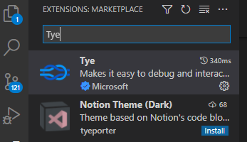
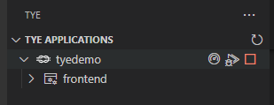
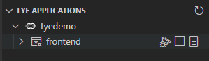

# Project Tye
1. Describe what PT is
2. Why is it experimental?
3. Should you still use it?

## Project Tye Resources
- [Git Hub Repository](https://github.com/dotnet/tye)
- [Project Tye Documentation](https://github.com/dotnet/tye/blob/main/docs/README.md)
    - [Getting Started](https://github.com/dotnet/tye/blob/main/docs/getting_started.md)

## Before you start
Even though you can use Project Tye from Visual Studio 2019 or 2022, I will be using VS Code with .NET SDK version 6.0.101.

### Install the Project Tye CLI 
>Project Tye is a global command line tool. These kinds of tools can be installed easily by using the *dotnet tool install* command. Please refer to the [Getting Started](https://github.com/dotnet/tye/blob/main/docs/getting_started.md) documentation for the latest command. I am using the CI/CD build because while I was experimenting with Tye, I ran into some hiccups with the **Undeploy** command.

From a Terminal window, install the Project Tye CLI with the following command:

```
dotnet tool install -g Microsoft.Tye --version "0.11.0-*" --add-source https://pkgs.dev.azure.com/dnceng/public/_packaging/dotnet5/nuget/v3/index.json
```
Once installed, the commands supported by Project Tye can be listed by entering the following into a terminal window: 

```
tye
```

|Command  | Description|
|--------| --------|
|init <path>    |    create a yaml manifest|
|run <path>     |    run the application|
|build <path>  |     build containers for the application |
|push <path>    |    build and push application containers to registry|
|deploy <path> |     deploy the application|
|undeploy <path>  |  delete deployed application|

Example:
```
tye run
```
### Install Docker for Desktop
> Docker is an essential component in the overall strategy of Project Tye. If you are not currently using Docker, don't let this intimidate you. Project Tye utlimately will "ease" you into Docker. Starting with Windows 10, Microsoft has provided the "Windows Subsystem for Linux", or, more commonly referred to as WSL. You will want to make sure that your system can run WSL 2.
- [Configure Windows 10 for WSL 2](https://docs.microsoft.com/en-us/windows/wsl/install#upgrade-version-from-wsl-1-to-wsl-2)
- [Configure Docker Desktop for WSL 2](https://docs.docker.com/desktop/windows/wsl/)

### Install the VS Code Plugin
> The Project Tye team have made a VS Code Extension for Tye. This plugin is one of the reasons that using VS Code to get started with Tye is recommended. it is listed in the Extensions Market place as "Tye."



### A Simple Example
> The Tye example starts with a frontend project and a backend project. The main idea is "Service Discovery" and how your Tye handles the connections between projects that it knows about.

The easiest example to begin with is not very impressive. However, it is a starting point on which we can begin.

Start by executing the following commands one at a time in a terminal window:

```
mkdir tyedemo
cd tyedemo

dotnet new razor -o frontend
dotnet new sln
dotnet sln add frontend
```
This creates a Razor page webapp called "frontend." A solution file was also created and the frontend project was added. 

Next, enter: `tye run`

Tye generates the following output:

```
[10:19:48 INF] Executing application from D:\projects\ProjectTyeBlogArticle\src\tyedemo.sln
[10:19:48 INF] Dashboard running on http://127.0.0.1:8000
[10:19:48 INF] Building projects
[10:19:50 INF] Application tyedemo started successfully with Pid: 17420
[10:19:50 INF] Launching service frontend_ad401214-5: D:\projects\ProjectTyeBlogArticle\src\frontend\bin\Debug\net6.0\frontend.exe
[10:19:50 INF] frontend_ad401214-5 running on process id 11084 bound to http://localhost:51094, https://localhost:51095
[10:19:50 INF] Replica frontend_ad401214-5 is moving to a ready state
[10:19:50 INF] Selected process 11084.
[10:19:50 INF] Listening for event pipe events for frontend_ad401214-5 on process id 11084
```
The output to highlight is

1. Tye has a dashboard and has started it
2. Tye build the projects in the solution and then assigns ports

## Tye Extension
With Tye Running, the Tye extension for VS Code shows the running application. Hover over the application, and several icons are displayed



1. The first icon will open the Tye Dashboard
2. The middle icon will attach VS Code to the running process for debugging
3. The last icon stops the application. This is the same as entering `Ctrl-C` in the terminal window.

Hovering over the frontend service



1. The first icon attaches a debugger to the process.
2. The middle icon will browse to the service.
3. The last icon will open up the service's log.

As more is added to the demo, observe what is displayed in the Tye extension.

## Tye Dashboard
The Tye Dashboard shows all of the running services. 
|Column| Description|
|----|---|
|Name| The name of the service. Clicking on the link displays metrics about the running service|
|Type| The type of services. For the initial demo, this is simply a .NET Project|
|Source| The location of the code|
|Bindings|The ports that Tye generated and assigned. Clicking on the link will open the website in another tab.|
|Replicas|Replicas are the number of instances of the service running. By default, it runs only 1 replica, but tye can be configured to run multiple.|
|Restarts|Lists the number of times the service restarted. This *should* have 0 restarts, but could indicate that something is wrong with the service if it continually resets.|
|Logs|Will display the current log output for the service.|

### Add a Web API


